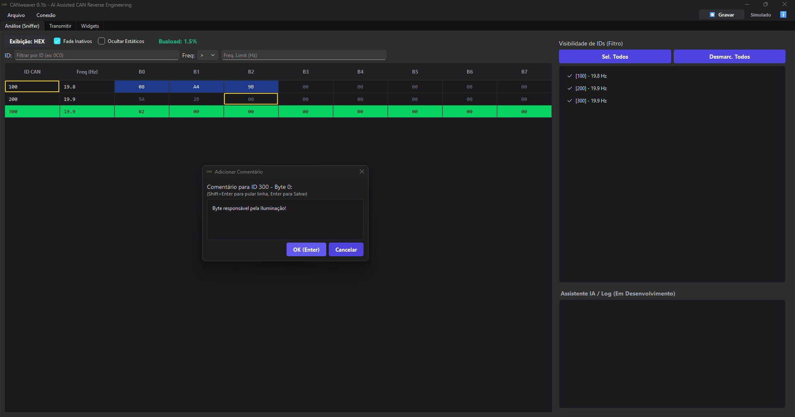
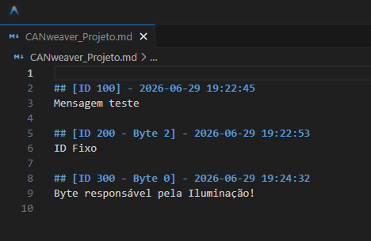
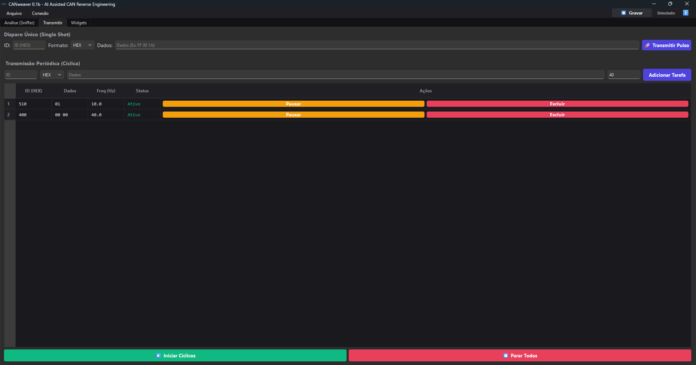
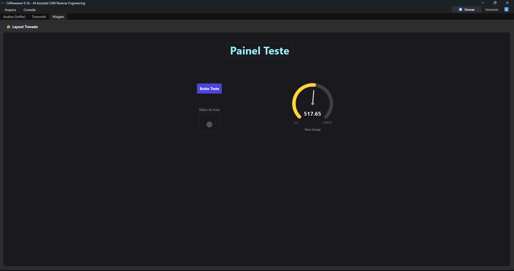
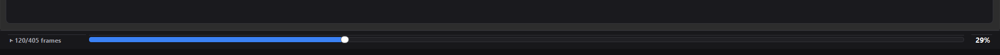

<div align="center">
  

  # CANweaver v2.0
  **AI Assisted CAN Reverse Engineering**
</div>

---

O **CANweaver** é uma ferramenta gráfica avançada desenvolvida em Python e PyQt6 para análise, simulação e injeção de pacotes em redes CAN (Controller Area Network). Projetado com foco em hacking automotivo, engenharia reversa e telemetria, ele transforma a leitura do caos hexadecimal em uma interface elegante, escura e extremamente dinâmica.

## 🚀 Principais Funcionalidades

### 🔍 Aba de Análise (Sniffer)
A aba principal do sistema onde você disseca o tráfego em tempo real.
- **Grid Dinâmico e Colorido:** As mensagens capturadas são alinhadas de forma organizada em uma tabela de alta performance. Quando um byte muda de valor, a célula correspondente pisca em azul para que seus olhos capturem a alteração instantaneamente.
- **Filtros Inteligentes:** Oculte mensagens estáticas que não estão sofrendo alteração ou oculte IDs inativos (mensagens que pararam de ser transmitidas pela rede). Isso permite focar puramente nos módulos que estão reagindo aos seus comandos físicos.
- **Sistema de Comentários Nativos:** Selecione e clique com o botão direito em um ID, byte ou até mesmo em um bit individual para adicionar comentários (`Shift+Enter`). Todas as anotações se transformam em bordas amarelas na tabela, servindo como uma "trilha de migalhas" visual para o seu progresso no hacking.
- **Geração de Markdown:** Todos os comentários feitos na tabela alimentam silenciosa e automaticamente um arquivo `CANweaver_Projeto.md`, gerando a documentação completa da sua engenharia reversa sem que você precise digitar um relatório do zero.


<br>


### 🥷 Aba de Transmissão (Injeção e Fuzzing)
O centro de controle para injetar dados de volta no barramento.
- **Single-Shot Pulse:** Dispare frames customizados instantaneamente (ID e Dados).
- **Transmissão Periódica:** Configure uma gama de mensagens em uma "playlist" e escolha exatamente a frequência desejada (ex: `10 Hz` = envio a cada 100ms). O software garante a estabilidade de envio cíclico.
- **Pausa Cirúrgica:** Pause e retome a transmissão de qualquer mensagem da sua lista individualmente, com 1 clique, sem precisar parar o tráfego inteiro.



### 🎛️ Aba de Widgets (Dashboard Customizado)
Transforme endereços hexadecimais em um painel veicular interativo completo, como se estivesse jogando um simulador.
- **Canvas Livre:** Uma área de edição destravável com função de exibição de grade geométrica (com eixos centrais) para alinhar visualmente seus componentes perfeitamente.
- **Componentes Visuais Ricos:** 
  - **Gauges Analógicos:** Crie velocímetros ou conta-giros. Suportam conversão complexa de tamanhos variáveis (de 1 a 4 bytes de payload simultâneo), conversão bruta para valores escalados via Fator Decimal de Float e redimensionamento infinito via menu. Múltiplos estilos visuais (Arco, Barras e Texto Livre).
  - **Indicadores (LEDs e Texto):** Leia bits específicos. Um LED pode acender verde se o Freio de Mão foi ativado no bit 3 do byte 0 da mensagem 0x300.
  - **Controladores (Botões):** Insira botões interativos para enviar comandos para a rede (modos de click/toggle/pulso) imitando comandos do volante.
  - **Labels Livres:** Títulos bonitos para decorar e setorizar o seu painel de controle.



### 📼 Gravação, Playback e Autosave
- **Player Automático:** Grave o fluxo da rede diretamente para o disco através do botão "Gravar". Volte depois e abra a ferramenta em modo "Playback". O programa exibirá uma barra inferior ("Player Bar") com controle preciso da linha do tempo do arquivo, mostrando a porcentagem do progresso e fazendo o replay num loop limpo para os seus widgets atuarem offline.
- **Sistema Inteligente de Resgate (Autosave):** Esqueceu de salvar e perdeu energia? O sistema roda um backup em background a cada 30 segundos em `autosave.cwp`. Quando reabrir o programa, ele oferecerá recuperar totalmente as suas janelas, layouts, tarefas de transmissão e comentários como mágica.
- **Salvar Como (`.cwp`):** Salve um projeto inteiro (Dashboards, Listas de Transmissão e Docs Markdown) empacotados em 1 único arquivo `.cwp` para compartilhar o progresso daquele carro com amigos.



---

## 🛠️ Tecnologias e Bibliotecas

- **[Python 3.10+]**
- **[PyQt6]** - O coração gráfico da arquitetura.
- **[python-can]** - Para comunicação física robusta via adaptadores USB (suporta SocketCAN, SLCAN, Vector, Kvaser, etc).
- **[pyserial]** - Escaneamento automático de interfaces COM/ttyUSB.

## ⚙️ Como Iniciar

1. Clone o repositório:
   ```bash
   git clone https://github.com/gabrielbolzani/CANweaver.git
   ```
2. Instale as dependências:
   ```bash
   pip install PyQt6 python-can pyserial
   ```
3. Execute o programa:
   ```bash
   python main.py
   ```

> **Aviso de Simulação:** Se você não tiver um adaptador conectado, o CANweaver inicializa vazio. Vá em `Conectar...`, altere o modo para **Simulado** e pronto: A engine carregará o `simulator.py` que cria dados hiper-realistas na rede (um motor ligando, ondas senoidais acelerando e LEDs de pisca/alerta interagindo para você testar todos os Widgets sem risco!)

## 📜 Licença e Contribuição
Este é um projeto para entusiastas e pesquisadores de Cyber Segurança Veicular. Hackeie com responsabilidade e mantenha o cinto de segurança apertado.
