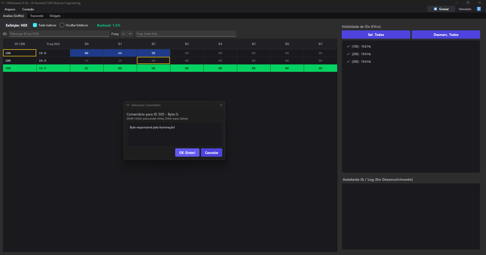
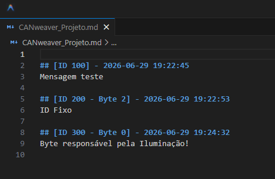
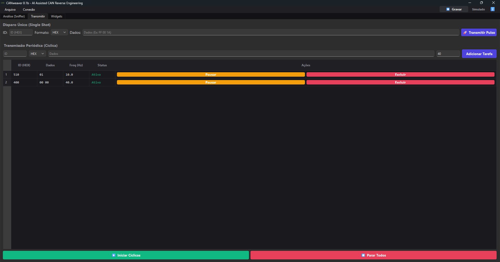
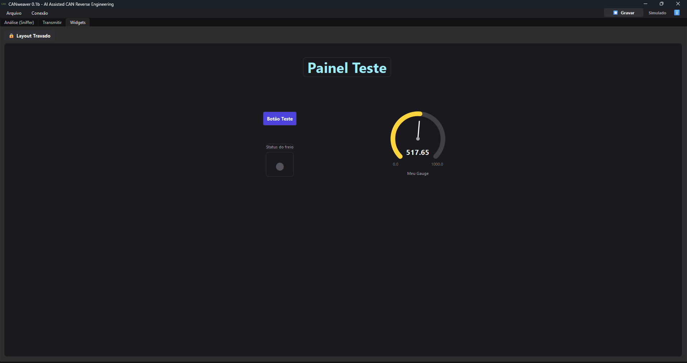

<div align="center">
  

  # CANweaver v2.0
  **AI Assisted CAN Reverse Engineering & Automotive Hacking Suite**
</div>

---

O **CANweaver** é uma plataforma gráfica avançada em Python e PyQt6 para análise, telemetria, simulação, injeção de pacotes e engenharia reversa assistida por Inteligência Artificial em redes CAN (Controller Area Network).

Desenvolvido para entusiastas, pesquisadores de cibersegurança veicular e desenvolvedores automotivos, o CANweaver transforma o fluxo hexadecimal de dados em uma experiência visual intuitiva, escura e extremamente dinâmica.

---

## 🚀 Principais Funcionalidades

### 🔍 Aba de Análise (Sniffer em Tempo Real)
A central de monitoramento onde o tráfego é dissecado ao vivo:
- **Grid Dinâmico e Reativo:** Mensagens alinhadas por ID em tabela de alta performance. Células que sofrem alteração piscam em azul instantaneamente.
- **Filtros Inteligentes:** Oculte mensagens estáticas que não variam ou remova IDs inativos (que pararam de transmitir há mais de 5 segundos).
- **Sistema de Anotações Nativo:** Clique com o botão direito em um ID, byte ou bit para adicionar comentários (`Shift+Enter`). Anotações ganham bordas amarelas de destaque.
- **Documentação Automática:** Comentários alimentam em segundo plano o arquivo `CANweaver_Projeto.md`, gerando o relatório técnico da engenharia reversa automaticamente.


<br>


---

### 🤖 CAN Copilot (Assistente de Engenharia Reversa com IA)
Um copiloto integrado com modelos de linguagem (Google Gemini, OpenAI GPT-4o, Ollama/Local) para acelerar a identificação de sinais:
- **Gravação de Ações Físicas:** Acione o botão de gravação (com duração configurável de 1 a 60 segundos) e realize um comando no veículo (ex: *pisar no freio*, *acionar seta*). O assistente calcula os deltas de bytes, alternâncias de bits (bit flips) e frequências.
- **Sugestão e Criação de Widgets:** Com 1 clique no chat, crie medidores (Gauges), botões ou LEDs no seu Dashboard sugeridos pela IA.
- **Aplicação de Filtros:** Deixe a IA identificar os IDs relevantes e aplicar o filtro de isolamento na tabela com um toque.
- **Análise de Arquivos:** Anexe logs de captura, especificações DBC, CSVs ou notas para interpretação do protocolo.
- **Segurança de Dados:** Suas chaves de API e configurações são salvas exclusivamente na sua máquina local (`~/.canweaver/ai_config.json`) e nunca são enviadas a repositórios Git.

---

### 🥷 Aba de Transmissão (Injeção e Fuzzing)
Centro de controle para transmissão e injeção de pacotes no barramento:
- **Single-Shot Pulse:** Dispare frames customizados instantaneamente (ID e Dados em HEX/BIN).
- **Transmissão Cíclica / Playlist:** Configure múltiplos pacotes e ajuste a frequência de envio desejada (ex: `10 Hz`, `50 Hz`, `100 Hz`).
- **Controle Individual:** Pause e retome transmissões individualmente sem interromper as demais mensagens.



---

### 🎛️ Aba de Widgets (Dashboard Automotivo Customizado)
Construa dashboards interativos em um canvas livre estilo cockpit:
- **Gauges Analógicos e Digitais:** Medidores estilo arco, barras e mostrador numérico com suporte a escala por fator decimal float e múltiplos bytes.
- **Indicadores de Estado e LEDs:** Monitoramento bit a bit com lógica de cores para alarmes e flags veiculares.
- **Controladores Interativos:** Botões e sliders (click, toggle, pulso e incremento) para injetar comandos interativamente.
- **Terminal CAN Integrado:** Exibição rápida de tráfego filtrado em janela flutuante no próprio painel.
- **Grade e Snap Magnético:** Alinhamento preciso dos elementos visuais e ajuste inteligente à largura de tela.



---

### 📼 Gravação, Playback e Autosave
- **Gravação em CSV:** Salve sessões completas de tráfego com timestamp de microssegundos e DLC.
- **Player de Reprodução (Playback):** Carregue gravações prévias e reproduza com barra de controle de tempo, seek e repetição em loop.
- **Autosave Inteligente:** Backup contínuo a cada 30 segundos em `autosave.cwp` para proteção contra quedas de energia.
- **Projetos Empacotados (`.cwp`):** Exporte e compartilhe seu projeto completo (Dashboards, listas de transmissão e documentação) em um único arquivo.

---

## 🛠️ Tecnologias e Pré-Requisitos

### Dependências Principais:
- **Python 3.10 ou superior**
- **PyQt6 (>= 6.4.0)** — Interface gráfica de alta performance.
- **python-can (>= 4.2.0)** — Comunicação com adaptadores CAN (SocketCAN, SLCAN, Vector, PCAN, Kvaser, etc.).
- **pyserial (>= 3.5)** — Suporte a adaptadores seriais/USB (SLCAN, CANable).

### Pré-Requisitos de Sistema (Linux):
Em sistemas Linux (como Ubuntu, Debian, Raspberry Pi OS ou Fedora), certifique-se de que as bibliotecas gráficas do Qt estão presentes:
```bash
# Ubuntu / Debian / Pop!_OS
sudo apt update
sudo apt install -y python3 python3-venv python3-pip libxcb-cursor0 libgl1 libegl1
```

---

## ⚙️ Instalação e Execução

O CANweaver inclui scripts de auto-inicialização que criam o ambiente virtual (`.venv`) e instalam as dependências automaticamente caso ainda não estejam presentes.

### No Linux / macOS / WSL:
```bash
git clone https://github.com/gabrielbolzani/CANweaver.git
cd CANweaver
chmod +x run.sh
./run.sh
```

### No Windows:
Dê um duplo-clique no arquivo **`run.bat`** ou execute via terminal (PowerShell / Prompt de Comando):
```bat
git clone https://github.com/gabrielbolzani/CANweaver.git
cd CANweaver
run.bat
```

### Instalação Manual (Opcional):
Caso prefira gerenciar o ambiente manualmente:
```bash
python -m venv .venv
# Ativar venv:
# Linux/macOS: source .venv/bin/activate
# Windows:     .venv\Scripts\activate

pip install -r requirements.txt
python main.py
```

---

## 🔌 Conexão com Hardware Real (CANable, SocketCAN, SLCAN)

O CANweaver suporta os adaptadores mais populares do mercado:

### 1. Adaptadores CANable / CandleLight
- **No Linux com Firmware CandleLight (Nativo):**
  O CANable com firmware candleLight cria uma interface `can0` nativa no kernel Linux. Conecte-se selecionando a interface `socketcan` e canal `can0`.
  *(O CANweaver pode subir a interface automaticamente através do menu de conexão).*
- **No Linux com Firmware SLCAN:**
  O dispositivo aparece como `/dev/ttyACM0` ou `/dev/ttyUSB0`. Para ter permissão de acesso à porta serial sem precisar de `sudo`:
  ```bash
  sudo usermod -aG dialout $USER
  # (Faça logout e login novamente para aplicar)
  ```
- **No Windows (SLCAN):**
  O CANable aparece como uma porta `COM` (ex: `COM3`, `COM4`). Na janela de conexão, selecione a interface `slcan`, e as portas disponíveis serão listadas automaticamente.

### 2. Descoberta Automática de Velocidade (Auto-Baudrate)
Se você não sabe a taxa de transmissão da rede do veículo (ex: 500 kbps, 250 kbps, 125 kbps):
1. Vá em **Conexão** -> **Descobrir Barramento (Auto-Baudrate)...**
2. Selecione a interface e canal do seu hardware.
3. Clique em **Iniciar Busca**. O sistema varre as frequências padrão em modo *listen-only* e exibe a taxa exata assim que frames forem capturados.

### 3. Modo Simulado (Sem Hardware)
Não possui um adaptador conectado no momento?
Abra **Conexão** -> **Conectar ao Barramento...**, selecione **Modo Simulado** e clique em **Conectar**. O motor integrado simula dados veiculares realistas (RPM acelerando, velocidade, temperatura e luzes indicadoras) para você testar todos os recursos imediatamente.

---

## 📜 Licença e Responsabilidade

Este software é destinado a testes, diagnóstico veicular, pesquisa e engenharia reversa ética de redes automotivas.
- É proibida a comercialização não autorizada deste software.
- Mantenha sempre o crédito aos autores originais em quaisquer forks ou modificações.
- Teste com segurança e mantenha a atenção no veículo.
